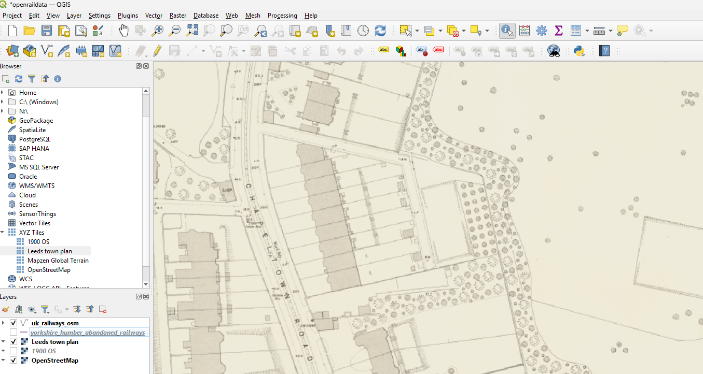

## Proprocessing

    ── Attaching core tidyverse packages ──────────────────────── tidyverse 2.0.0 ──
    ✔ dplyr     1.1.4     ✔ readr     2.1.5
    ✔ forcats   1.0.0     ✔ stringr   1.5.2
    ✔ ggplot2   3.5.2     ✔ tibble    3.3.0
    ✔ lubridate 1.9.4     ✔ tidyr     1.3.1
    ✔ purrr     1.1.0     
    ── Conflicts ────────────────────────────────────────── tidyverse_conflicts() ──
    ✖ dplyr::filter() masks stats::filter()
    ✖ dplyr::lag()    masks stats::lag()
    ℹ Use the conflicted package (<http://conflicted.r-lib.org/>) to force all conflicts to become errors
    Linking to GEOS 3.13.0, GDAL 3.10.1, PROJ 9.5.1; sf_use_s2() is TRUE

    Loading required namespace: tmaptools

    Please set segment_center = TRUE to divide the centre into multiple segments

### Plan

- Download the town map dataset from Scottish Library:
  https://maps.nls.uk/os/townplans-england/leeds2.html
- Digitise the tramway centerlines from there
- Digitise the tram network from Alex’s image data
- Combine both datasets into a single tramway network
- Bonus: track lines
- Comparing with OSM

### Town plan data

Individuals tiles can be accessed from URLs such as
https://mapseries-tilesets.s3.amazonaws.com/os/town-england/North/19/259898/168840.png

This is raster ‘tile pyramids’ - zoom level 19, tile coordinates 259898,
168840.

<!-- We can import this image: -->

The general pattern is:
https://mapseries-tilesets.s3.amazonaws.com/os/town-england/North/{z}/{x}/{y}.png

You can copy-paste that URL into QGIS ‘XYZ Tiles’ to access the tiles
directly as shown below:

<!-- You can download the tiles using R as follows: -->

You can also use the `ceramic` package to download tiles:

## Research

- Compare with historic economic and usage data
- …
